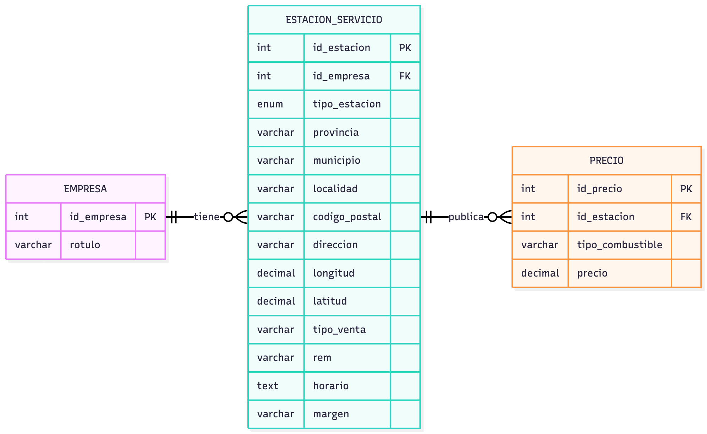

# Proyecto de Importación y Gestión de Datos de Estaciones de Servicio

Este proyecto implementa un sistema completo para **procesar archivos CSV**, transformar sus datos y almacenarlos en una base de datos **MySQL**, desplegada mediante **Docker**.
El backend está desarrollado en **Java**.



---

## 🧱 Arquitectura General

### ✔ Base de Datos en Docker (MySQL)

Se utiliza un contenedor Docker para desplegar una instancia de MySQL.
A continuación se muestra un ejemplo de `docker-compose.yml`:

```yaml
services:
  mysql:
    image: mysql:8
    container_name: estaciones_mysql
    environment:
      MYSQL_ROOT_PASSWORD: root
      MYSQL_DATABASE: estaciones
    ports:
      - "3306:3306"
    volumes:
      - ./mysql_data:/var/lib/mysql
```

La base de datos incluye las tablas:

- `empresa`
- `estacion_servicio`
- `precio`

---

## ⚙ Procesamiento e Inserción de Datos (Java)

El proyecto está desarrollado en Java y organizado en los siguientes módulos:

- **Modelos** – Representan las entidades del dominio.
- **DAO** – Acceso a datos y operaciones sobre MySQL.
- **Controller** – Gestión del CSV y mapeo de campos.
- **Config** – Configuración de la conexión a la base de datos.

El flujo del programa:

1. Leer el CSV original
2. Normalizar campos
3. Convertir valores a objetos de dominio
4. Insertar datos en MySQL usando los DAO
5. Mantener la integridad relacional (empresa → estación → precios)

---

## 🧩 Gestión Dinámica de Campos del CSV

Los CSV oficiales variaban su orden de columnas entre versiones.
Para evitar errores, se implementó un sistema para obtener los campos **por nombre**, no por índice:

```java
private String getField(String[] fields, Map<String, Integer> map, String name) {
    Integer i = map.get(name.toLowerCase());
    return (i != null && i < fields.length) ? fields[i].trim() : "";
}
```

Esta técnica mejora:

- Robustez
- Flexibilidad
- Compatibilidad entre diferentes CSV

---

## 🔢 Normalización de Valores Numéricos

Muchos valores venían en formato europeo (con coma decimal).
Para evitar errores se implementó:

```java
private BigDecimal parseBigDecimal(String value) {
    if (value == null || value.isEmpty())
        return null;
    try {
        return new BigDecimal(value.replace(",", "."));
    } catch (NumberFormatException e) {
        return null;
    }
}
```

Esto permite convertir correctamente valores como `1,234` → `1.234`.

---

## 🚢 Clasificación de Estaciones: Terrestre vs Marítima

El tipo de estación no venía explícito en los CSV.

Por ejemplo:

- `"Gasóleo de uso marítimo"`

A partir de ciertas palabras clave se determinó si la estación debía clasificarse como:

- **terrestre**
- **marítima**

Esta lógica garantiza una normalización precisa en la base de datos.

---

## 🗄 Diseño de la Base de Datos

Las tablas principales son:

### **empresa**

Almacena las empresas propietarias.

### **estacion_servicio**

Registra ubicación, coordenadas, tipo de estación y demás datos relevantes.

### **precio**

Incluye los precios asociados a cada tipo de combustible por estación.

---

# 1️⃣ Compilar y ejecutar manualmente

```bash
javac -cp ".:lib/mysql-connector-j-9.4.0.jar" $(find src -name "*.java")
java -cp ".:lib/mysql-connector-j-9.4.0.jar:src" App
```

En la carpeta **resources** se encuentran las _querys solicitadas para el trabajo_.

---

# 📊 Consultas SQL del Proyecto

A continuación se incluyen las consultas utilizadas para verificar la integridad de los datos, así como las consultas solicitadas en el trabajo.

---

## 🔍 Verificación de datos duplicados

### **1. Verificar precios duplicados**

```sql
SELECT id_estacion, tipo_combustible, COUNT(*) AS num_precios
FROM precio
GROUP BY id_estacion, tipo_combustible
HAVING COUNT(*) > 1
ORDER BY num_precios DESC;
```

### **2. Verificar estaciones duplicadas**

```sql
SELECT id_empresa, longitud, latitud, COUNT(*) AS num_estaciones
FROM estacion_servicio
GROUP BY longitud, latitud, id_empresa
HAVING COUNT(*) > 1
ORDER BY num_estaciones DESC;
```

### **3. Verificar empresas duplicadas**

```sql
SELECT rotulo, COUNT(*) AS num_empresas
FROM empresa
GROUP BY rotulo
HAVING COUNT(*) > 1
ORDER BY num_empresas DESC;
```

---

## 📌 Consultas del Trabajo

### **1. Nombre de la empresa con más estaciones de servicio terrestres**

```sql
SELECT e.rotulo, COUNT(*) AS estaciones
FROM empresa e, estacion_servicio s
WHERE e.id_empresa = s.id_empresa
  AND s.tipo_estacion = 'TERRESTRE'
GROUP BY e.rotulo
ORDER BY COUNT(*) DESC
LIMIT 1;
```

### **2. Nombre de la empresa con más estaciones de servicio marítimas**

```sql
SELECT e.rotulo, COUNT(*) AS estaciones
FROM empresa e, estacion_servicio s
WHERE e.id_empresa = s.id_empresa
  AND s.tipo_estacion = 'MARITIMA'
GROUP BY e.rotulo
ORDER BY COUNT(*) DESC
LIMIT 1;
```

### **3. Estación más barata con «Gasolina 95 E5» en el municipio de Madrid**

Incluye: precio, empresa, localización y margen.

```sql
SELECT e.id_empresa, p.precio, e.rotulo, s.municipio, s.direccion, s.margen
FROM empresa e, estacion_servicio s, precio p
WHERE e.id_empresa = s.id_empresa
  AND s.id_estacion = p.id_estacion
  AND UPPER(s.municipio) = UPPER('Madrid')
  AND p.tipo_combustible = 'Gasolina 95 E5'
ORDER BY p.precio
LIMIT 1;
```

### **4. Estación más barata con «Gasóleo A» a menos de 10 km del centro de Albacete**

Rango aproximado:

- Latitud: **38.90 – 39.09**
- Longitud: **–1.94 – –1.78**

```sql
SELECT e.id_empresa, p.precio, e.rotulo, s.municipio, s.direccion, s.margen
FROM empresa e
JOIN estacion_servicio s ON e.id_empresa = s.id_empresa
JOIN precio p ON s.id_estacion = p.id_estacion
WHERE UPPER(s.municipio) = UPPER('Albacete')
  AND p.tipo_combustible = 'gasóleo a'
  AND s.latitud BETWEEN 38.90 AND 39.09
  AND s.longitud BETWEEN -1.94 AND -1.78
ORDER BY p.precio
LIMIT 1;
```

### **5. Provincia con la estación marítima más cara para «Gasolina 95 E5»**

```sql
SELECT s.provincia
FROM estacion_servicio s
JOIN precio p ON s.id_estacion = p.id_estacion
WHERE s.tipo_estacion = 'MARITIMA'
  AND p.tipo_combustible = 'Gasolina 95 E5'
ORDER BY p.precio DESC
LIMIT 1;
```
